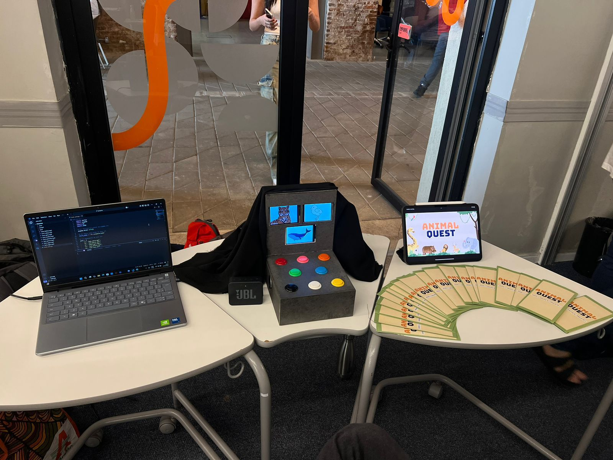
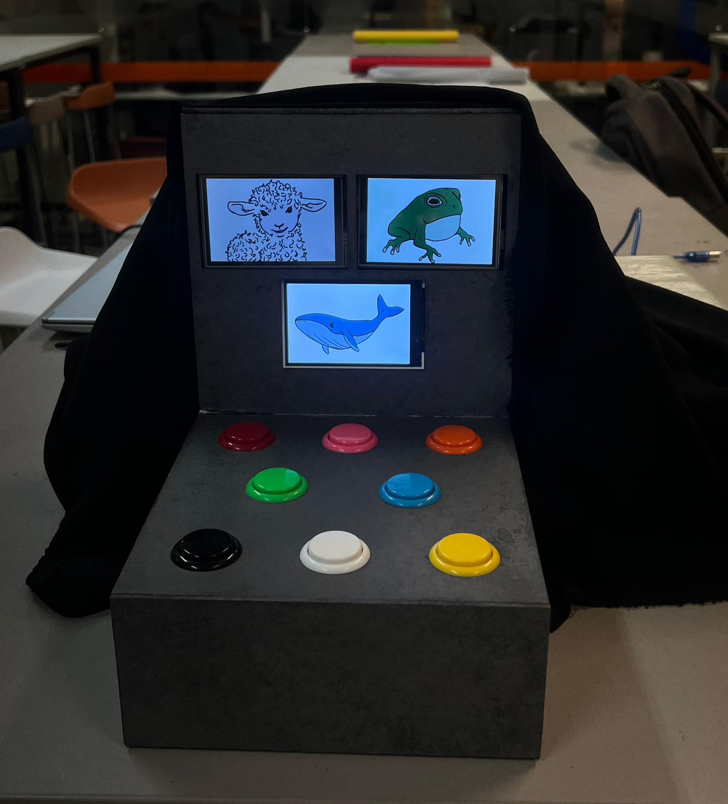

## 🌐 Estrutura do Site

O site é composto por quatro páginas HTML principais:

| Arquivo        | Função                                                                 |
|----------------|------------------------------------------------------------------------|
| `index.html`   | Página inicial de apresentação do autor e breve introdução             |
| `sobre.html`   | Curiosidades e interesses profissionais de Felipe                      |
| `projeto.html` | Explicação detalhada do projeto Animal Quest + imagens ilustrativas    |
| `contato.html` | Links para redes sociais e chamada para contato                        |

Além dos HTMLs, temos os seguintes arquivos de suporte:

| Arquivo           | Tipo         | Descrição                                                                 |
|-------------------|--------------|---------------------------------------------------------------------------|
| `estilos.css`     | CSS          | Define o layout, cores, fontes, e responsividade do site                  |
| `script.js`       | JavaScript   | Controla o tema claro/escuro e exibe mensagens interativas                |
| `animalquest1.jpeg` | Imagem     | Foto do jogo exposto em uma feira (Mostra Tech)                           |
| `animalquest2.jpeg` | Imagem     | Foto básica do jogo em funcionamento                                      |

### 💬 Mensagem Interativa
Ao clicar em certos botões, o usuário vê uma **mensagem de agradecimento** via `alert()`:

```javascript
function mostrarMensagem() {
  alert("Agradeço pela visita ao meu portfólio! Caso queira saber mais, é só me contatar.");
}
```

### 📱 Responsividade
O site utiliza boas práticas de CSS para manter a leitura agradável em diferentes tamanhos de tela.

## ✨ Galeria do Projeto


*Exposição do projeto na Mostra TechDesign.*


*Visual do jogo com botões e displays.*

## 📌 Tecnologias Utilizadas

- HTML5
- CSS3
- JavaScript (Vanilla)
- Navegador Web (interface client-side)

# 🐸 Sobre o Animal Quest 

## 📚 Contexto do Projeto

O **Animal Quest** nasceu a partir de estudos sobre:

- Deficiência Intelectual
- Metodologias de Ensino Baseadas em Jogos (Game-Based Learning)
- Tecnologias Assistivas

### 🎯 Objetivo
Criar uma ferramenta **inclusiva**, **interativa** e **multissensorial** que facilite o aprendizado e o desenvolvimento cognitivo, principalmente o raciocínio lógico, de forma divertida.

## 🧠 Como Funciona o Jogo

O Animal Quest simula um ambiente interativo com:

- **3 displays** digitais para apresentar os estímulos visuais (animais).
- **8 botões físicos** com cores diferentes, que o usuário deve apertar em resposta às imagens.
- **Feedback sonoro**, visual e tátil simultâneo.

O jogo é pensado para ser fácil de entender, engajador e acessível a diversos perfis de usuário, respeitando as limitações cognitivas de cada um.

## 👤 Sobre mim  
📍 Recife – PE  
🎓 Estudante de Ciência da Computação — CESAR School  
💻 Interesse por desenvolvimento de jogos, software e resolução de problemas.

### 📲 Contatos

- [LinkedIn](https://www.linkedin.com/in/felipelemos001)
- [GitHub](https://github.com/felipelemos11)
- [Instagram](https://www.instagram.com/felipelemos11)

## 🚀 Como Executar o Projeto

1. Baixe ou clone este repositório.
2. Abra o arquivo `index.html` em seu navegador.
3. Navegue pelas seções para conhecer um pouco mais sobre mim e o projeto do Animal Quest.

